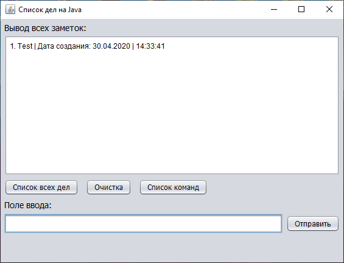

# Java ToDoList MySQL

## FAQ & Troubleshooting

• On Windows/MacOS, install Oracle Java from [here](https://www.oracle.com/java/technologies/javase-downloads.html) or OpenJDK from [here](https://adoptopenjdk.net/).

## Commands

* add, add Index, edit Index, delete index, del index, delete all, list
* адд, адд индекс, изменить индекс, удалить индекс, удалить все, лист
* P. S. Index/индекс = цифра
* P. S.2 Если слово начинается с большой буквы, то комманду писать не нужно!

## If you want use your MySQL change this

*  private static final String CONN = "jdbc:mysql://ip:3306/DB_NAME?useSSL=false";
*  private static final String USER = "DB_NAME";
*  private static final String PASS = "DB_PASSWORD";
